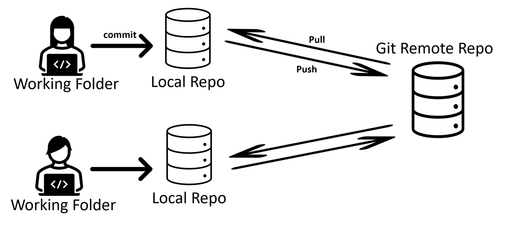
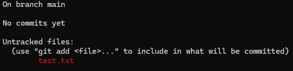
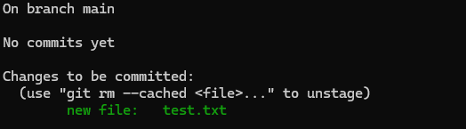
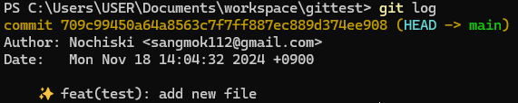

# Chapter 1

## 학습 목표
- git 설치 및 초기 세팅
- git hub과 개인 컴퓨터 연동
- 로컬 리포지토리에 파일을 커밋하고, 로그 찍어보기

## Git 설치하기
[여기](https://git-scm.com/downloads/win)에 접속해 깃을 설치합니다.

설치 후 다음 명령어를 통해 git이 설치됨을 확인합니다
```bash
git --version
```

## 초기 세팅하기
```bash
git config --global user.name "사용자 이름"
git config --global user.email "이메일 주소"
```
파워쉘이나 터미널을 여신 후, 따옴표는 유지한채로 ```사용자 이름```과 ```이메일 주소```에 본인 github 이메일 주소와 본인 이름을 적습니다.

```bash
git config --list
```
위 명령어로 이메일 주소와 이름이 제대로 적용되었는지 확인 할 수 있습니다.

### Github 아이디와 기기 연결하기
Github과 같은 원격 저장소와 개인 기기를 연결하기 위해서는 SSH가 가장 안전한 방식입니다. (무엇보다 github이 곧 http 연결 방식 지원을 종료 할 예정입니다.)

#### SSH란
**ssh**란 일종의 데이터 전송 암호화 프로토콜이며 빠르고 보안상 유리하다는 장점이 있습니다. 내장되어 있는 openssh와 같은 프로그램을 통해 ```공개키```와 ```개인키```를 생성할 수 있는데, 이때 ```개인키```는 절때 남에게 공유되어선 안됩니다.

SSH 키는 다음과 같은 명령어로 생성 할 수 있습니다.
```bash
ssh-keygen -t ed25519 -C "your_email@example.com"
```

이후 다음 명령어를 통해 공개키를 클립보드로 복사합니다.
```bash
eval $(ssh-agent -s)
ssh-add ~/.ssh/id_ed25519
cat ~/.ssh/id_ed25519.pub
```

만일 cat 명령어가 작동하지 않으면 다음을 시도합니다.
```bash
clip < ~/.ssh/id_ed25519.pub
```

이후 github에 로그인 후, 우측 상단에 프로필 사진을 눌러 ```Settings```를 클릭합니다.
그리고 좌측의 ```SSH and GPG Keys``` 탭을 클릭합니다.

```New SSH Key``` 버튼을 클릭해 ```Title``` 항목에 어떤 디바이스 이름을 적고, 
Key type은 ```Authentication key```로 지정한 후 
클립보드에 복사해둔 ssh키를 ```Key``` 항목에 붙여넣습니다.

```bash
ssh -T git@github.com
```
위 명령어를 입력해 깃헙에 제대로 등록되었는지 확인합니다.

만일 다음과 같이 나타난다면 ssh 연결이 성공적으로 된 것입니다.
```
Hi {username}! You've successfully authenticated, but GitHub does not provide shell access.
```


## 리포지토리 생성하기
리포지토리란 프로젝트 파일을 저장할 수 있는 저장소를 의미합니다. 
Git은 git 서버에 저장되는 원격 리포지토리와, 개인 컴퓨터에 저장되는 로컬 리포지토리 두가지가 존재합니다.

<p style="font-style: italic; text-align: center;">이미지 출처 : https://kr.mathworks.com/help/matlab/matlab_prog/use-git-in-matlab.html</p>


깃허브 메인페이지로 돌아가서 초록색 ```new``` 버튼을 클릭합니다.

```repository name```란에 적절한 이름을 지은 후 public으로 한 채로 create repository 버튼을 누릅니다.

이렇게 원격 리포지토리를 생성했습니다.


## 리포지토리 클론하기
클론은 원격 리포지토리에 있는 데이터를 로컬로 가져오는 행위를 말합니다. 방식은 다음과 같습니다.

1. 생성된 원격리포지토리의 URL로 접속 후, 초록색 ```<> Code``` 버튼을 클릭합니다.

2. Clone 탭에서 ssh를 클릭 후 주소를 복사합니다.

3. 터미널에서 적절한 폴더에 들어간 후 다음 명령어를 입력합니다.
```bash
git clone <ssh URL>
```

예시
```bash
git clone git@github.com:portal301/asdf.git
```

이후 폴더에 제대로 클론이 되었는지 확인합니다.

## 첫 커밋 해보기
커밋이란 수정된 상태의 스냅샷을 리포지토리에 저장하는 행위를 말합니다. 이번엔 첫 커밋을 작성해보겠습니다.


새 txt파일을 생성합니다. 이후 아무 텍스트를 집어넣습니다.

Git 시스템에서 각 파일은 크게 Tracked(관리대상임)와 Untracked(관리대상이 아님)로 나눕니다.

Tracked 파일은 이미 스냅샷에 포함되어 있던 파일입니다. 

Tracked 파일은 또 다음과 같은 상태로 나눠집니다. 
- Unmodified(수정하지 않음)
- Modified(수정함)
- Staged(커밋하면 저장소에 기록되는) 

처음 저장소를 Clone하면 모든 파일은 Tracked이면서 Unmodified 상태가 됩니다. 이는  파일을 아무것도 수정하지 않았기 때문입니다.

상태를 확인해보기 위해서는 ```git status```명령어를 사용합니다.

```bash
git status
```

그러면 터미널에 다음과같이 나타날 것입니다.


이는 새로 만든 파일이 untracked라는 의미입니다.

텍스트파일을 tracked 상태로 바꾸기 위해서는 다음 명령어를 사용해야합니다.

```bash
git add <filename.txt>
```

예시
```bash
git add asdf.txt
```
이후 다시 ``` git status``` 명령어를 사용하시면, 다음과 같은 화면을 볼 수 있습니다.



이제 파일을 tracked 상태로 만들었으니, 커밋을 해보겠습니다.

커밋은 다음 명령어로 실행할 수 있습니다.

```bash
git commit -m "message"
```

쌍따옴표 사이 메시지는 수정 내역을 적으시면 됩니다.
#### ❌ 나쁜 예시
```bash
git commit -m "버그 수정"
```
#### ⭕ 좋은 예시
```bash
git commit -m "FIX : XXX 파일에 YYYY 문제가 있던 부분 수정"
```

```bash
git commit -m "FEATURE : ZZZ 기능 구현"
```

## 커밋 로그 찍어보기
커밋 로그를 확인하기 위해서는 ```git log```명령어를 사용합니다.

그러면 다음과 같은 화면이 나타납니다.



Log 명령어는 커밋 로그를 시간 순서대로 보여줍니다.

커밋을 하나 더 추가해 본 후 다시한번 ```git log``` 명령어를 실행해보세요.

## 커밋 로그 더 편하게 보기
윈도우 기준으로,``` C:\Users\<사용자 이름>\.gitconfig```에 접근 합니다.

해당 파일을 메모장으로 열어 다음을 복사 붙여넣기 합니다.
```
[alias]
lg1 = log --graph --abbrev-commit --decorate --format=format:'%C(bold blue)%h%C(reset) - %C(bold green)(%ar)%C(reset) %C(white)%s%C(reset) %C(dim white)- %an%C(reset)%C(auto)%d%C(reset)' --all
lg2 = log --graph --abbrev-commit --decorate --format=format:'%C(bold blue)%h%C(reset) - %C(bold cyan)%aD%C(reset) %C(bold green)(%ar)%C(reset)%C(auto)%d%C(reset)%n''          %C(white)%s%C(reset) %C(dim white)- %an%C(reset)'
lg = lg1
```

다시 프로젝트 폴더에 들어가 ```git lg``` 명령어를 사용합니다.

## Conclusion
이번 장에서는 Git의 설치부터 초기 설정, GitHub과의 연동, 리포지토리 생성 및 클론, 첫 커밋 작성과 커밋 로그 확인에 이르기까지 Git의 기본적인 사용법을 다루었습니다. Git은 소스 코드 관리의 핵심 도구로, 버전 관리와 협업을 효율적으로 수행할 수 있게 도와줍니다.

### 주요 학습 내용 요약

- Git 설치 및 초기 설정: Git을 설치하고 사용자 이름과 이메일을 설정하여 기본 환경을 구성했습니다.

- GitHub과의 연동: SSH 키를 생성하고 GitHub과 안전하게 연동하여 원격 저장소와의 통신을 설정했습니다.

- 리포지토리 관리: 원격 리포지토리를 생성하고 로컬에 클론하여 프로젝트를 관리하는 방법을 배웠습니다.

 - 커밋과 로그: 파일을 추적하고 첫 커밋을 작성한 후, git log 명령어를 통해 커밋 기록을 확인하는 방법을 익혔습니다.
