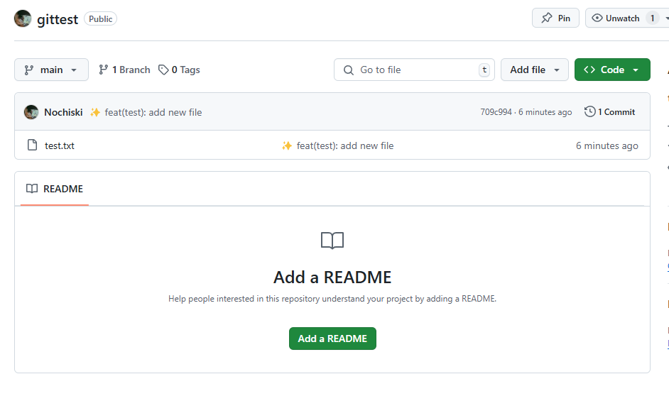
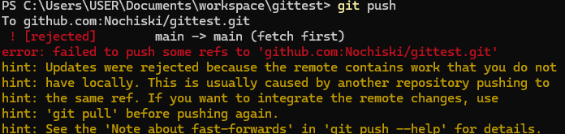
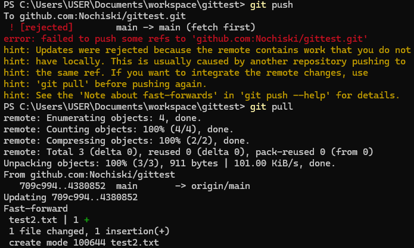
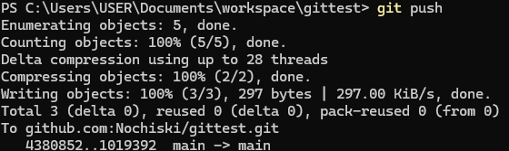
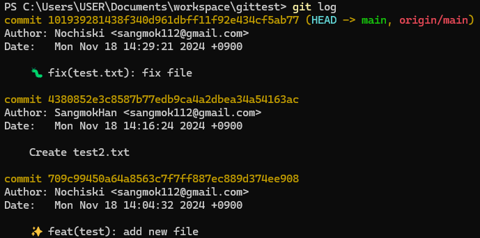
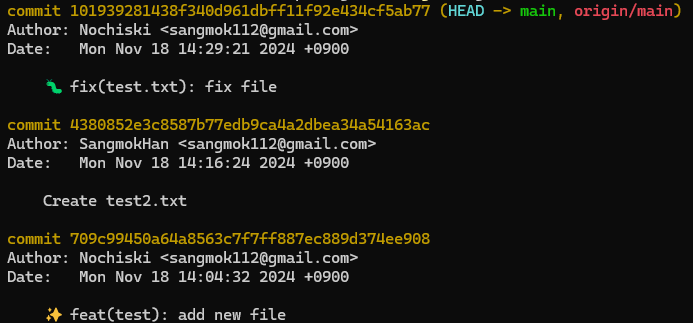
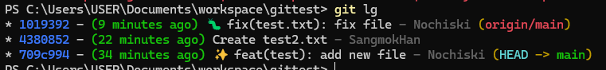

# Chapter 2

## 학습 목표
- 원격 저장소에 커밋을 Push합니다.
- 원격 저장소의 데이터를 받아옵니다.
- 저장소의 상태를 이전 커밋으로 되돌립니다.

## 원격 리포지토리로 Push하기
이제 로컬 리포지토리에 있던 작업물을 원격 서버에 업로드 할 시간입니다.
다음 명령어를 통해 원격 서버에 간단하게 업로드 할 수 있습니다.
```bash
git push
```

이제 깃허브 리포지토리에 접속하여 성공적으로 push가 되었는지 확인합니다.



### 저는 Push가 안되는데요?

만약 다음과 같은 메시지가 등장한다면, 당황하지마세요.



이는 누군가의 작업물이 이미 remote repository에 push 되어서,
여러분의 로컬 머신의 리포지토리에 저장된 원격 리포지토리 정보와 다르기 때문에
git이 자동으로 저장소의 무결성을 보호하는 과정입니다.

그렇다면 어떻게 작업물을 푸쉬할 수 있을까요?

## 원격 리포지토리의 작업물을 받아오기
바로 ```git pull``` 명령어를 사용하면 됩니다.

이를 통해 원격 리포지토리의 커밋 히스토리를 로컬에 갱신하고

로컬 머신이 가지고있는 원격의 정보와, 원격의 실제 정보가 일치할때 push가 가능합니다.




이후 로그를 확인하면 다음과 같은 화면을 볼 수 있습니다.



## 이전 커밋으로 되돌아가기
우리는 저장소에 지금까지 3개의 커밋을 한 상태입니다.

만약 여기서 두 번째 커밋과 세 번째 커밋에 문제가 있는데, 정확히 어느 부분이 문제인지 모르는 상황이라고 가정해봅시다.

가장 이상적인 상황은 버그를 고쳐 새로운 커밋을 push하면 하면 되지만, 시간상 처음으로 돌아가서 작업하는게 더 빠른 경우도 있습니다

이럴때는 ```git reset``` 명령어를 사용하면 됩니다.

```bash
git reset <hash number>
```
ex)
```bash
git reset 709c99
```

혹은 
```bash
git reset --hard <hash number>
```
ex)
```bash
git reset --hard 709c99
```

```--hard``` 옵션은 그 시점에서 unstaged된 작업물을 날린채로 이전 커밋으로 돌아가겠다는 의미입니다. 만약 마지막 커밋 이후로 추가적인 변경점이 없다면 크게 상관없는 옵션입니다.


### 뒤에 있는 번호는 무엇인가요?
```709c99```는 해당 커밋의 해시넘버로, 위 사진의 첫 번째 커밋 해시 넘버인 ```709c99450a64a8563c7f7ff887ec889d374ee908```를 줄인것입니다. 일반적으로 모든 해시넘버를 다 입력할 필요는 없고, 6자리면 충분합니다. 따라서 여러분은 여러분의 해시넘버를 입력하셔야합니다.

아니면 
```bash
git reset --hard HEAD~2
```
를 사용해도 됩니다.

### HEAD요?
```HEAD```란 현재 로컬 리포지토리에서 작업중인 마지막 커밋을 의미합니다.



즉, 가장 위 커밋에서 ```HEAD -> main, origin / main```의 의미는 
main(로컬의 main)과 origin / main(원격의 main)의 마지막 커밋이 ```101939``` 커밋이라는 의미입니다. HEAD는 현재 로컬머신에서 작업중인 브랜치를 뜻하며, 즉
```HEAD->main```은 현재 로컬에서 작업중인 브랜치가 main이라는 의미입니다.

만약 git reset 명령어로 커밋을 되돌렸다면 다음과 같이 나타납니다.



```HEAD->main```이 첫번째 커밋을 가리키고 있고, ```origin/main```은 여전히 원격을 가리키고 있습니다.

**ch3**에 진입하기 전, 다시 ```git reset``` 명령어를 사용하여 가장 최근 커밋으로 되돌리겠습니다.

<details> <summary>명령어 보기</summary>

```bash
git reset --hard 101932
```

</details>

## 결론
이번 장에서는 원격 저장소와의 상호작용과 커밋을 되돌리는 방법에 대해 학습했습니다.

### 핵심 요약
#### 1. 원격 저장소에 Push하기:

- git push 명령어를 사용하여 작업물을 원격 저장소에 업로드할 수 있습니다.
- Push가 실패하면 git pull을 사용해 원격의 최신 상태를 가져온 후, 다시 Push합니다.
#### 2. 원격 저장소에서 Pull하기:

- git pull 명령어를 통해 원격 저장소의 데이터를 로컬로 동기화합니다.
- 이를 통해 원격과 로컬의 커밋 히스토리를 일치시킵니다.
#### 3. 커밋 되돌리기:

- git reset <hash number>를 사용해 특정 커밋으로 되돌아갈 수 있습니다.
- ```--hard``` 옵션을 사용하면 작업 디렉토리도 해당 커밋 상태로 초기화됩니다.
- 커밋 해시나 ```HEAD~N```을 활용해 손쉽게 원하는 시점으로 이동할 수 있습니다.

### 알아두어야 할 점
- 원격 저장소와 로컬 저장소의 동기화를 유지하는 것이 중요합니다.
- 커밋 되돌리기 명령어는 강력하지만 작업 내용을 잃을 수 있으므로, 사용 전에 충분히 주의하세요.
- Git은 복잡한 작업 흐름을 단순화해주는 강력한 도구이지만, 꾸준히 연습하며 익히는 것이 필요합니다.
- 이제 Chapter 3에서는 브랜치를 관리하고, 협업을 위한 Git 사용법을 다뤄볼 예정입니다. 조금 더 복잡한 Git 워크플로우를 탐험하며 협업의 기본기를 다질 준비를 해봅시다!🚀
