# Chapter 3

## 학습 목표
- 브랜치를 생성하는 방법에 대해 배웁니다.
- 로컬에 브랜치를 Merge 하는 방법에 대해 배웁니다.
- git rebase 명령어에 대해 배웁니다.

## Branch
Git 브랜치는 저장소의 특정 시점에서 독립적으로 작업을 진행할 수 있는 가상의 작업 공간입니다.

단어의 뜻 그대로, 큰 나무에서 가지를 치는것처럼 작업을 나눠서 별도로 할 수 있게 해줍니다.

만일 다른 가지(branch)에서 뭔가 잘못돼도 원래 나무는 안전하게 남아 있을 수 있다는 장점이 있습니다.

또한 끝난 가지는 다시 나무에 붙여서(merge) 모든 작업을 합칠 수 있습니다! 🌳

### Conflict

먼저, Branch의 효용에 대해 알아보기 위해 여러 사람이 같은 파일을 동시에 작업 후 푸쉬해보겠습니다.

이후 늦게 Push하신 쪽에서 다음과 같은 메시지를 보실 수 있습니다.

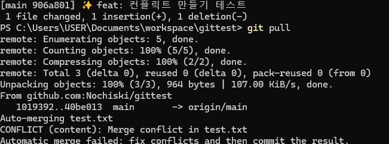

이제, 수정 파일을 열어보겠습니다.

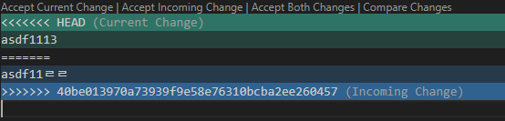

위에 초록색 영역은 로컬에서 변경된 영역이고, 푸른색 영역은 Pull 명령어를 통해 받아온 원격의 작업 내역입니다.

Git은 파일의 내용을 줄 단위로 비교하여 병합하려고 시도합니다. 대부분의 경우 자동 병합이 가능하지만, 수정된 내용이 충돌할 경우 어떤 변경을 유지할지 결정할 수 없어서 충돌이 발생합니다.

이때 수정 방법은 적절한 협의를 통해 원하는 쪽을 선택후, 반대쪽은 삭제하시면 됩니다.

이때 필수적으로 ```<<<<HEAD```, ```========```, ```>>>>hash``` 영역은 삭제되어야 합니다.

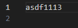

<p style="text-align: center"> 저는 제 작업분을 선택했습니다. </p>

이후 ```git add```와 ```git commit``` 명령어를 통해서 컨플릭트를 고친 커밋을 생성합니다.

### 그래서 이게 왜 필요하다고요?
만약 여러 사람이 같은 파일을 자주 이렇게 수정하게 된다면, 이는 매 커밋마다 conflict를 수정해야하기 때문에, 오히려 생산성을 떨어트리는 문제가 됩니다.

따라서 branch를 통해 크게 분리를 해, 최종 작업이 끝난 후 한번에 검수하는 프로세스를 만들어서 자주 conflict가 나지 않는 상황을 만들어야 합니다.

물론 가장 이상적인 환경은 같은 파일을 동시에 수정하지 않는 것 입니다.

### 브랜치 생성하기
branch 생성은 ```git branch``` 명령어를 통해 생성 할 수 있습니다.
```bash
git branch {branch name}
```
<details>
<summary> 예시 </summary>

```bash
git branch feature/test
```

</details>


### 브랜치로 이동하기
브랜치 이동은 ```git checkout``` 명령어를 통해 수행됩니다.

```bash
git checkout {branch name}
```

<details>
<summary> 예시 </summary>

```bash
git checkout feature/test
```
</details>

### 둘을 한번에 하기
```git checkout -b {브랜치 이름}```을 사용하여 생성과 이동을 한번에 가능합니다.

<details>
<summary> 예시 </summary>

```bash
git checkout -b feature/test
```
</details>

### 브랜치에 커밋 생성하기
브랜치에 새로운 파일을 만들고 커밋을 생성해보겠습니다.

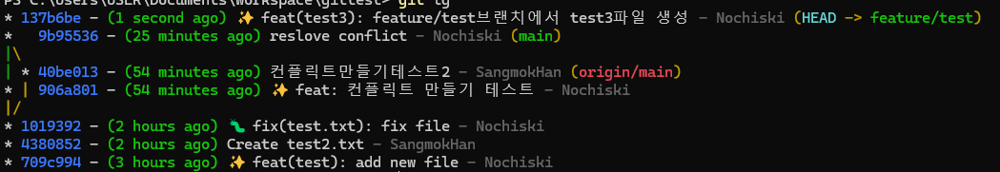

```git lg```를 했을때 위와 비슷하게 나온다면 성공입니다.

## 브랜치 Merge하기

Merge는 분기한 가지(Branch)를 원래 main 브랜치로 합치는 과정입니다.

과정은 다음과 같습니다.

1. 브랜치의 base branch(여기서는 main)로 이동
    ```bash
    git checkout main
    ```
2. merge 실행
    ```bash
    git merge feature/test
    ```

그러면 다음과 같은 그래프를 보실 수 있습니다.

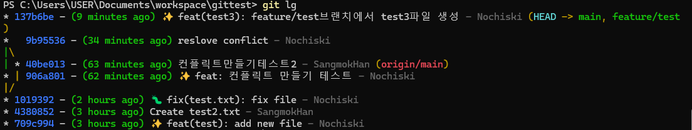

```Head```가 main을 가리키며, ```feature/test```도 같이 있다면 성공입니다.


### 브랜치 제거하기
브랜치를 제거하는 명령어는 ```git branch -D``` 옵션입니다.

방금 생성한 브랜치를 다음 명령어를 사용해 삭제해보겠습니다.

<details>
<summary>
예시
</summary>

```bash
git branch -D feature/test
```
</details>

```git branch``` 명령어를 통해 삭제를 확인할 수 있습니다.

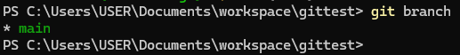

## Rebase


```git rebase```는 브랜치의 변경 내역을 다른 브랜치 위로 다시 적용하여 깔끔한 커밋 히스토리를 만드는 명령어입니다.

- 간단히 말해, 브랜치를 새로운 기반(base) 위에 재정렬하는 과정입니다.
- 히스토리를 선형으로 만들어, 협업 중에 병합 기록이 복잡해지는 것을 방지합니다.

한 쪽에서 ```git branch``` 명령어로 새로운 브랜치를 만들어보겠습니다.

<details>
<summary>
예시
</summary>

```bash
git branch feature/rebase
```
</details>

이제 커밋을 두 개 추가해보겠습니다.
<details>
<summary>
예시

</summary>

``` bash
임의의 파일 생성
git add .
git commit -m "새 파일 생성"
임의의 파일 수정
git add .
git commit -m "파일 수정"
```
</details>

이후 메인으로 돌아가 커밋 하나를 추가해 최종적으로 다음과 같은 형태의 그래프를 만들어보겠습니다.

<details>
<summary>
예시
</summary>

```bash
git checkout main
파일 수정 후
git add .
git commit -m "메인에 커밋만들기"
```
</details>

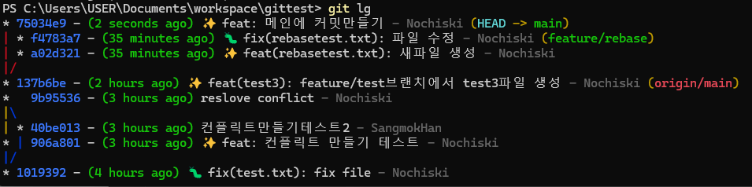

다시 생성해둔 브랜치로 돌아가, 리베이스를 실행해보겠습니다.

rebase 명령어는 ```git rebase```를 통해 실행합니다.
```bash
git checkout feature/rebase //rebase 실행할 브랜치로 이동
git rebase main
```

그러면 다음과 같은 그래프를 만들 수 있습니다.

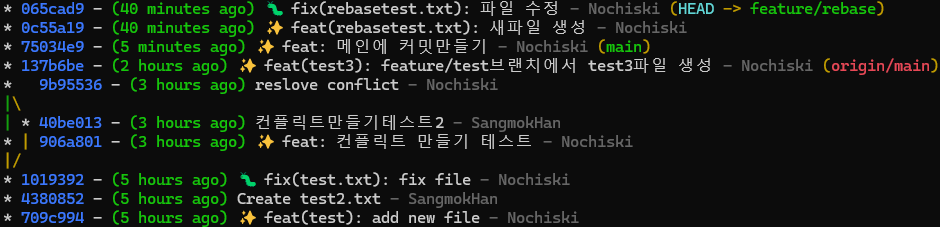

### 차이점이 보이시나요?
잘 모르시겠다고요? 

한번 브랜치를 merge해보겠습니다.

<details>
<summary>
예시
</summary>

```bash
git checkout main
git merge feature/rebase
```
</details>

그러면 다음과 같은 그래프를 볼 수 있습니다.

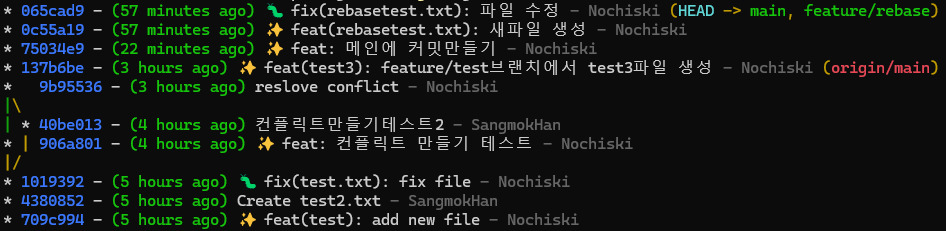

커밋 ```137b6be``` 아래는 ```rebase```를 사용하지 않고 단순히 ```merge```한 영역이며, 윗부분은 ```rebase``` 후 ```merge```를 실행한 영역입니다.
그래프를 보면 아래쪽은 병렬로 얽힌 복잡한 연결이 있는 반면, 윗부분은 선형적으로 깔끔하게 이어져 있는 것을 확인할 수 있습니다.

이러한 선형 그래프 구조의 주요 장점은 다음과 같습니다:

**1. 버그 추적이 쉬워집니다**

- 히스토리가 선형으로 정리되어 있으면, 버그가 발생한 커밋을 정확히 식별할 수 있습니다.
- 이는 복잡한 병합 그래프에서 혼란스럽게 얽힌 커밋들 사이에서 원인을 찾는 것과는 큰 차이가 있습니다.

**2. 변경 사항의 맥락이 명확해집니다**

- 각 커밋은 독립적이고 논리적으로 정리되어 있어, 해당 변경이 왜 이루어졌는지 빠르게  이해할 수 있습니다.
- 팀원이 프로젝트 히스토리를 처음 분석하거나, 나중에 과거 작업을 다시 검토할 때 큰 도움이 됩니다.
  
이 구조는 잘 정리된 서류 캐비닛과 비슷합니다.

필요한 자료를 빠르게 찾을 수 있어, 시간과 노력을 절약할 수 있습니다.

또한, **merge** 시 발생하는 **conflict를 최소화**할 수 있어 협업 시 불필요한 문제를 줄이고, **팀 생산성을 향상**시킵니다. 특히 대규모 팀 프로젝트에서는 이런 깔끔한 히스토리가 협업의 원활함을 좌우할 수 있습니다. 😊


>git을 잘 사용한다는것은, 단순히 코드 공유툴로서 사용하는것을 넘어 깔끔한 작업 히스토리를 유지한다는것을 의미하기도 합니다.


## Rebase 조금 더 잘 써보기
```rebase``` 명령어는 브랜치 병합에도 사용되지만, ```-i``` 옵션을 통해 커밋을 직접적으로 수정하는데도 사용할 수 있습니다.

사용 방법은 다음과 같습니다.

```bash
git rebase -i {수정 범위}
```

<details>
<summary>
예시
</summary>

```bash
git rebase -i HEAD~1 // Head부터 바로 뒤 커밋까지 수정
```
</details>

우선 실습을 위해, 새로운 커밋을 생성해보겠습니다.

>이때 중요한점은 절때 새로운 커밋을 원격에 Push 해서는 안됩니다.

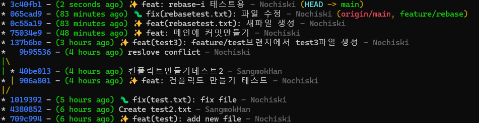

명령어를 입력한다면 다음과 같은 화면이 나타납니다.

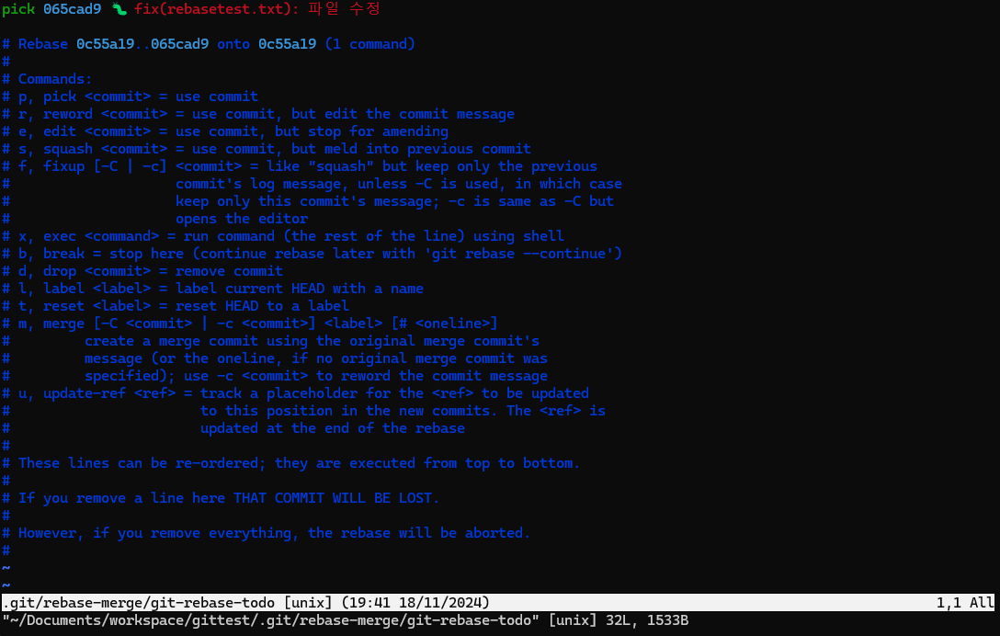

```i``` 키를 눌러 ```INSERT``` 모드로 전환하고 ```pick```을 ```reword```로 바꾸고 ```esc``` + ```:wq```를 입력합니다.

이후 다음 화면이 나타나면 다시 ```i``` 키를 눌러, 메시지를 수정 후 ```esc``` + ```:wq```를 눌러 저장합니다.
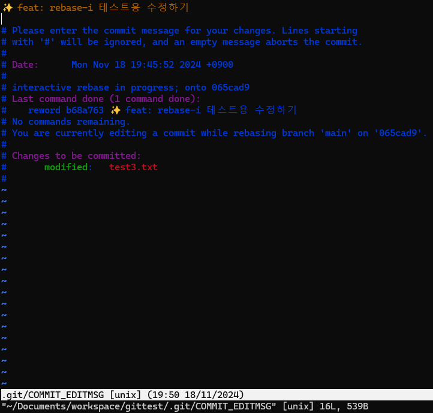

정상적으로 수정되었다면 다음과 같은 변경을 확인할 수 있습니다.

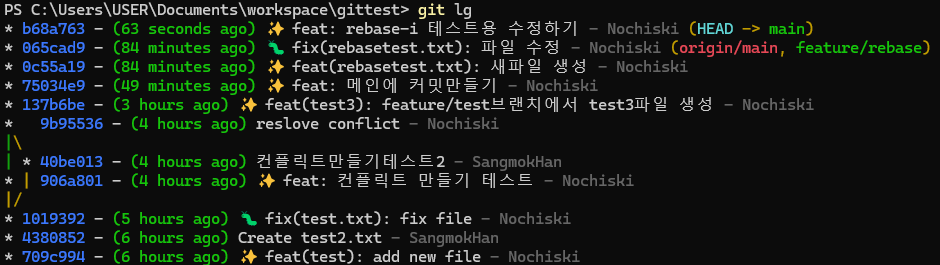


### 다른 옵션들
```rebase -i``` 옵션으로 사용할 수 있는 명령어는 다음과 같습니다.
| 명령어    | 설명                                                   |
|-----------|--------------------------------------------------------|
| `pick`    | 커밋을 그대로 유지                                      |
| `reword`  | 커밋 메시지 수정                                       |
| `edit`    | 커밋 내용을 수정                                       |
| `squash`  | 커밋을 이전 커밋과 병합 (커밋 메시지는 병합 후 수정 가능)|
| `fixup`   | 커밋을 이전 커밋과 병합 (커밋 메시지는 삭제)           |
| `drop`    | 커밋 삭제                                              |

## rebase 시 주의점!
git rebase 명령어는 원격에 올라간 히스토리에는 되도록 사용을 지양하는 편이 좋습니다. 그 이유는 다음과 같습니다.

### 1. Rebase가 히스토리를 변경하기 때문
- git rebase는 기존 커밋들을 "다시 작성"합니다. (즉, 새로운 커밋 ID를 생성합니다.)
- 원격 브랜치에서 Rebase를 실행하면 이미 Push된 커밋의 히스토리가 변경됩니다.
- 결과적으로, 원격 저장소와 다른 팀원들의 로컬 저장소 사이에 불일치가 발생합니다.
  
### 2. 협업 중 충돌 발생 가능
- 팀원들은 이미 변경 전의 커밋을 기준으로 작업을 진행하고 있을 수 있습니다.
- Rebase 이후 팀원들이 Pull을 하면, 로컬 히스토리가 원격 히스토리와 충돌하여 예상치 못한 문제(예: Merge Conflict)가 발생할 수 있습니다.
- 해결하려면 팀원들이 강제적으로 로컬 히스토리를 삭제하거나 재설정해야 하며, 이는 비효율적이고 실수의 여지가 많습니다.

### 3. Rebase 후 강제 Push가 필요
- Rebase 이후에는 **강제 푸시(git push --force)** 가 필요합니다.
- 강제 푸시는 기존 원격 저장소의 히스토리를 덮어쓰므로, 다른 팀원들이 이를 Pull하거나 자신의 변경사항을 Push할 때 문제가 발생합니다.

### 4. 팀의 작업 흐름에 혼란 초래
- Rebase로 히스토리가 변경되면 팀원들이 동일한 브랜치를 기준으로 작업할 수 없게 됩니다.
- 팀원들은 병합 기록을 이해하기 어려워지고, 문제가 발생한 원인을 찾는 데 더 많은 시간을 소비하게 됩니다.

## 결론
이번 장에서는 Git의 브랜치 관리와 rebase 명령어를 활용한 커밋 히스토리 정리에 대해 학습했습니다.

### 핵심 정리
#### 브랜치 관리:

- Git 브랜치는 작업을 분리하여 독립적으로 진행할 수 있는 강력한 도구입니다.
- 브랜치를 통해 충돌을 최소화하고 협업 생산성을 높일 수 있습니다.
- 브랜치를 생성, 이동, 병합, 삭제하는 방법을 익혔습니다.
#### Merge와 Rebase:

- Merge는 각 브랜치의 히스토리를 유지하며 병합합니다.
- Rebase는 히스토리를 선형으로 정리해 깔끔하고 읽기 쉬운 작업 흐름을 만듭니다.
- Rebase와 Merge의 차이점과 적절한 사용 시점을 이해했습니다.
#### Rebase -i:
- git rebase -i를 통해 커밋 메시지 수정, 병합(Squash), 삭제 등으로 히스토리를 정리할 수 있습니다.
- 이를 활용하면 PR(Pull Request)을 깔끔히 정리하여 팀원들이 작업 내역을 쉽게 이해할 수 있습니다.
  
#### 주의 사항:
- Rebase는 개인 작업이나 Push되지 않은 브랜치에서만 사용해야 합니다.
- 원격 브랜치에서 Rebase를 사용할 경우 협업 환경에서 큰 혼란을 초래할 수 있으므로, 원격 히스토리 변경은 신중히 진행해야 합니다.
  
### 왜 깔끔한 히스토리가 중요한가?
- **버그 추적 용이**: 선형 히스토리는 문제를 찾고 디버깅하기 훨씬 쉽습니다.

- **변경 사항 이해**: 명확하게 정리된 커밋은 작업의 맥락을 쉽게 파악하게 해줍니다.

- **협업 효율 향상**: 팀원이 이해하기 쉬운 히스토리는 협업 중 혼란을 줄이고, 생산성을 높입니다.

### 마무리
Git은 단순히 코드를 저장하고 공유하는 도구를 넘어, 깔끔한 히스토리를 유지하여 효율적인 협업 환경을 제공하는 강력한 도구입니다.

브랜치와 Rebase의 올바른 사용은 팀 프로젝트에서 유지보수성과 가독성을 크게 향상시킵니다. 이제 실습과 연습을 통해 이를 익히고, 팀의 협업 생산성을 높이는 데 활용해 보세요! 🚀

